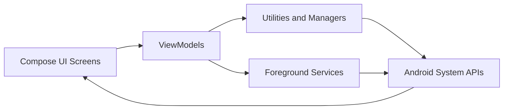

# NetSwiss App

<p align="left">
  
  
  
  
  
</p>

NetSwiss is an Android network utility toolkit built with Kotlin and Jetpack Compose. It combines mock GPS tools, cellular diagnostics, real-time speed monitoring, per-app firewall control, and package installation in one app.

## Architecture



## Features

### Mock GPS
- Full-screen map (OSMDroid) with tap-to-place marker
- Search with suggestions plus manual lat/lng entry
- Start/stop mock location foreground service
- "Locate me" recenter action

### Network Mode
- Live network type and signal details
- dBm display with quality indicator
- Quick launch to radio settings (when OEM ROM allows)

### Speed Monitor
- Real-time up/down throughput via `TrafficStats`
- Foreground notification with dynamic speed icon
- Peak/session transfer stats
- Optional ping/jitter stability view

### App Firewall
- Per-app internet block using native `VpnService`
- Installed app listing with label/icon/package
- Toggle blocking per app
- Foreground VPN notification and stop action

### Package Installer
- Secure install for `.apk`, `.aab`, `.xapk`, `.apks`, `.apkm`
- Smart ZIP extraction + spoofing checks
- Android `PackageInstaller` Session API integration

## Tech Stack

- Kotlin
- Jetpack Compose + Material 3
- Navigation Compose
- OSMDroid
- Android Foreground Services
- Android `VpnService`
- Coroutines + Flow

## Requirements

- Android Studio Hedgehog or newer
- JDK 17
- Android SDK `compileSdk=34`, `targetSdk=34`, `minSdk=26`

## Build and Run

```bash
./gradlew assembleDebug
./gradlew installDebug
```

Windows PowerShell:

```powershell
.\gradlew.bat assembleDebug
.\gradlew.bat installDebug
```

## Setup Notes

### Mock GPS
1. Enable Developer Options.
2. Open Developer Options -> Select mock location app.
3. Choose `NetSwiss`.
4. Grant location permission.

### Firewall
1. Open Firewall tab.
2. Tap Start Firewall.
3. Accept VPN permission.
4. Toggle apps to block/unblock internet.

## Permissions

- `ACCESS_FINE_LOCATION`, `ACCESS_COARSE_LOCATION`
- `READ_PHONE_STATE`
- `ACCESS_NETWORK_STATE`
- `INTERNET`
- `POST_NOTIFICATIONS` (Android 13+)
- `QUERY_ALL_PACKAGES`
- Foreground-service permissions + `BIND_VPN_SERVICE`

## Project Structure

```text
app/src/main/java/com/netswiss/app
  |- navigation/
  |- service/
  |- ui/
  |   |- components/
  |   |- screens/
  |   |- theme/
  |- util/
```

## Disclaimer

- Hidden radio settings access depends on OEM restrictions.
- VPN/firewall behavior may vary by Android vendor builds.
- Use mock location and firewall features responsibly.
